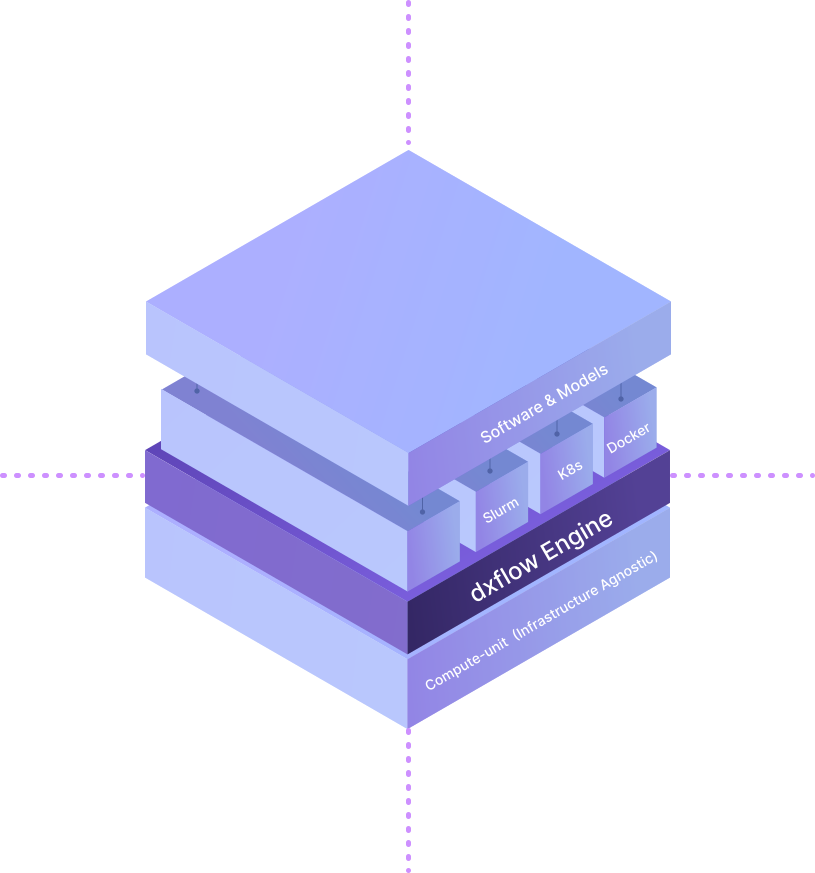

## What is dxflow?

`dxflow` is an comprehensive interface, providing a unified way to manage and orchestrate your data & compute workflows across different computing environments. It has different features:

Also, it can be seen as a distributed-computing engine, helps to simplify utilizing computational resources and create a hybrid environment for your data & computational pipeline workflows.

::callout
In short: dxflow turns any machine you can boot into a first‑class citizen of your computational fleet, with one installer, a stable URL, and a unified interface for jobs, logs, and data.
::

dxflow engine can be divided into two main parts:

1. **Server:**
   It is when you want to create a compute-unit to run your data & compute workflow. The server can be a closed system, such as a Slurm cluster, or a cloud-based system, such as AWS, GCP, or Azure. It can also be a local machine or a Docker container. Also, it can be accessible remotely or have no access at all. (see more detail on the [Server](#server) section below)

2. **Client:**
   It is the interface that lets you access the server and run your data & compute workflows. It can be a command line interface (CLI), a web-based user interface (UI), or an API interface. The client can be used to create, start, stop, and monitor workflows, as well as manage files and other resources on the server.

- **Infrastructure (Layer 1)** – Raw compute: cloud VMs, GPU nodes, on‑prem clusters, or even your laptop.

- **dxflow Engine (Layer 2)** – A lightweight daemon you install on every compute‑unit. It auto‑registers with the control plane, stages data, authenticates users, and translates high‑level workflows into commands understood by the local scheduler/runtime.

- **Orchestration Runtimes (Layer 3)** – The native workload managers already living on the node (Kubernetes, Slurm, Docker, Singularity, MPI, etc.). dxflow talks to these via pluggable adapters so your YAML never changes when you switch environments.

- **Application Layer (Layer 4)** – The domain software scientists actually run: simulation codes, bioinformatics pipelines, ML training loops, post‑processing scripts.

## Why dxflow?

| Challenge | How dxflow solves it |
| --- | --- |
| Fragmented environments – every site has its own scheduler, security rules, and data paths. | One runtime, one interface. Install dxflow everywhere and interact through a consistent CLI, REST/GRPC API, or web UI. |
| Manual data staging slows researchers. | Integrated file‑hub. Resumable uploads/downloads, cross‑node transfers, and automatic clean‑up built in. |
| Bursty demand makes static clusters costly. | Cloud‑agnostic bursting. Spin up spot instances or GPU farms on any provider, tear them down automatically when the queue drains. |
| Security complexity across VPNs and firewalls. | Auto‑provisioned TLS endpoints (<hash>.dxflow.ai) or Unix‑socket mode, plus RSA key‑pair auth with fine‑grained roles. |
| Opaque job status on multi‑tool stacks. | Real‑time dashboards & streaming logs flow back to the DiPhyx control plane—or your own dashboard—regardless of the underlying scheduler. |

## Who needs dxflow?

Technically anyone who wants to manage and orchestrate their data & compute workflows can use dxflow. However, it is mainly designed for people who want to build and manage data pipelines and workflows across different computing environments.

It can have many applications, such as:

* Data Science
* Bioinformatics
* Computational Biology
* Distributed Computing
* Edge-Computing

Or really any domain that requires a compute-unit to run data & compute workflows.

## Security & Privacy

dxflow uses RSA security to authenticate users and services with the dxflow engine. RSA security using cryptography is one of the suggested practices to keep your data safe. dxflow provides different permission access levels, such as:

* read-only
* terminal
* file-management
* full access

This allows you to control who can access your workflows and files, and what they can do with them.

Also, the connection between dxflow servers are managed through SSL certificates, which provides a secure connection between the servers. This allows you to connect to remote dxflow servers securely and manage your workflows and files across different computing environments.
