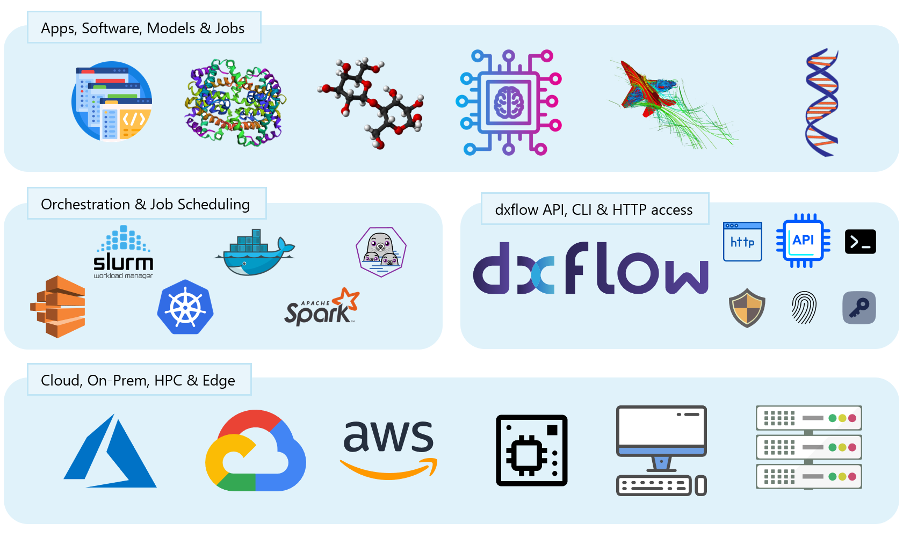

## Deployment Patterns
There are two deployment patterns for dxflow:

| Name            | Definition                                                                                                                                                            |
|-----------------|-----------------------------------------------------------------------------------------------------------------------------------------------------------------------|
| **Node-Embedded**  | Every compute node or container runs its own dxflow agent; there is **no extra control layer** between the infrastructure (cloud, on-prem device, HPC, etc) and the scheduler (Slurm, K8s, Docker, etc.) |
| **Federated Master** | A *master* dxflow instance sits between the infrastructure and schedulers, orchestrating the dxflow fleet (clients) running on each node or container. |


In both of these method, dxflow agent provides a unified interface for
- API: It helps user to access the compute-unit it is running on.
- CLI: It provides a command line interface to interact with the compute-unit.
- Console: It provides a web console to interact with the compute-unit.
- Proxy: It provides a proxy to access the compute-unit.

The most common deployment pattern is the **Node-Embedded**. In this pattern, each compute node or container runs its own dxflow agent, which directly interacts with the resource scheduler (like Slurm, Kubernetes, Docker, etc.) and the scientific applications. This setup allows for a straightforward and efficient execution of computational tasks without the need for an additional control layer.

### Node-Embedded Deployment

In the Node-Embedded deployment, every compute target, be it an EC2 spot instance, an on-prem Slurm node, or a Docker container on a lab workstation, runs its own copy of dxflow server. The agent boots in ≤ 2 seconds, registers an RSA key-pair with the fleet, and immediately exposes a uniform set of endpoints:
#### [API](/api)
```url
http://localhost:<port>/api — REST & gRPC

```
#### [CLI](/cli)
```
```bash
dxflow <cmd> — local CLI passthrough
```
#### [Console](/console)
```url
http://localhost:<port>/console — web console

```
and console access via a web browser at `http://localhost:<port>/console`.

Because the runtime is embedded at the node level, dxflow cohabits peacefully with any resource scheduler already present:

- Slurm / PBS / LSF: the prolog script starts dxflow when a job allocation begins.
- Kubernetes / Nomad: deploy the agent as a DaemonSet or side-car.
- Docker Compose / Podman: include the dxflow container in the same docker-compose.yml.
- Spark / Ray / AWS Batch: each executor or EC2 instance bundles the agent via user-data.

This design mirrors the side-car model popularised by Dapr: place a lightweight process next to every workload to provide cross-cutting capabilities (for Dapr: service discovery, pub-sub, state; for dxflow: data staging, secure shell, log streaming, UI). The result is a flat fleet of self-sufficient nodes—no single point of failure, and no extra tier to manage.

### Federated Master Deployment
In the federated master deployment, a single dxflow instance acts as a control plane for the entire fleet of compute nodes. This master instance orchestrates the dxflow agents running on each node or container, providing a centralized interface for managing and monitoring the computational tasks. This setup is particularly useful for larger deployments where centralized management and monitoring are required.
